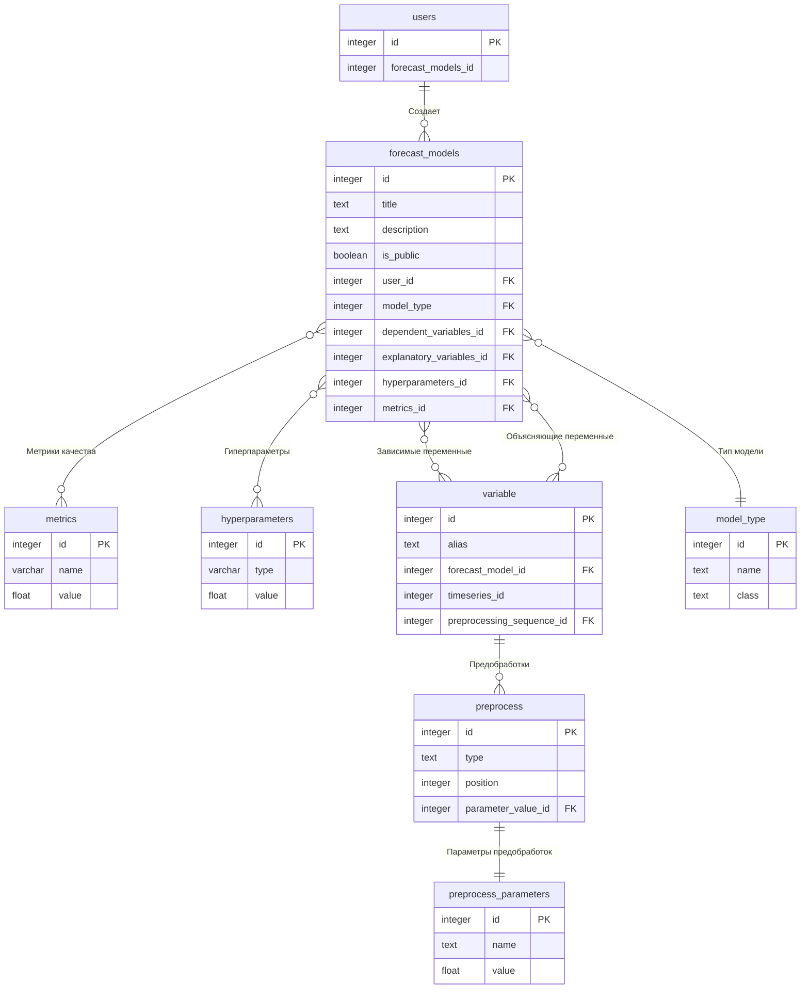

Тут лежат все схемы и модели для баз данных
# Сущности проекта

# Схемы
## Ряды:
1. [Timeseries](./Timeseries.md) - временной ряд
2. [Preprocess](./Preprocess.md) - единица предобработки ряда
## Модели:
1. [ArimaxParams](./ArimaxParams.md) - параметры ARIMAX
2. [Forecasts](./Forecasts.md) - прогнозы модели
3. [Metric](./Metric.md) - метрика качесвтва модели
4. [Coefficient](./Coefficient.md) - коэффициент перед параметром в линейной модели (ARIMA/VAR)