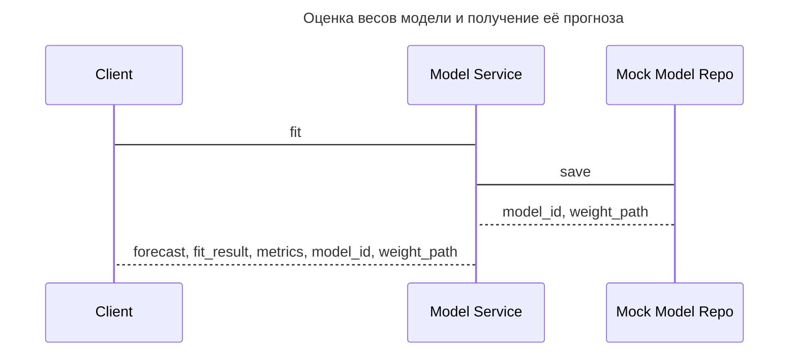

Реализация зависит от способа промежуточного хранения оцененных коэффициентов/весов модели, поэтому в рамках прототипа (до интеграции с хранилищем) будет реализован следующий функционал

Для каждого типа моделей будут достаточно разные схемы и возвращаемые результаты. Например, для моделей классов SARIMAX или VAR мы будем возвращать коэффициенты модели, когда для ML/DL моделей это не нужно

--- 
## Оценка коэффициентов ARIMAX
`POST api/v1/model/arimax/fit`

--- 
### Описание метода
Метод оценивает коэффициенты ARIMAX, возвращает прогноз (на тренировочной, тестовой выборке и вневыоброчный прогноз), метрики качества полученной модели (RMSE, MAE и adj-R^2), а также путь до полученных весов модели

---
### Параметры запроса:

| Поле                     | Схема                        | Описание                                    |
| ------------------------ | ---------------------------- | ------------------------------------------- |
| dependent_variables      | [[Timeseries]]               | зависимая переменная (таргет)               |
| explanatory_variables_id | Optional List [[Timeseries]] | список обьясняющих переменных (опционально) |
| hyperparameters          | [[ArimaxParams]]             | параметры ARIMAX                            |

---
### Ответы:
#### Успешный (200)
| Поле        | Схема                | Описание                                                                                                          |
| ----------- | -------------------- | ----------------------------------------------------------------------------------------------------------------- |
| forecasts   | [[Forecasts]]        | Прогнозы (внутривыборочные и вневыборочный)                                                                       |
| fit_result  | List [[Coefficient]] | Результаты оценки модели в виде её коэффициентов и их значимостей                                                 |
| weight_path | string               | путь до оцененных весов модели                                                                                    |
| model_id    | int                  | ID модели в БД                                                                                                    |
| metrics     | List [[Metric]]      | Список метрик качества модели. В UC обучения модели они будут наперед заданные, скорее всего RMSE, MAPE и adj-R^2 |

#### Неправильный запрос (400)
| Поле   | Схема  | Описание        |
| ------ | ------ | --------------- |
| error  | int    | Код ошибки      |
| detail | string | Описание ошибки |
